# Jarkom-Modul-1-2026-K-41

|         Nama         |     NRP     |
|----------------------|-------------|
|Rayhan Fadhilah Allayn| 5027251126  |
|Aliya Rahmadina       | 5027251056  |

## Deskripsi Soal

Router Lain terhubung ke internet lewat NAT/DHCP di interface eth0, dan memiliki 3 interface LAN (eth1, eth2, eth3) yang masing-masing tersambung ke Switch1, Switch2, Switch3. Kelima entitas (client) terhubung sebagai berikut:
- Switch1 -> Alice, Mika
- Switch2 -> Chisa
- Switch3 -> Knights, Eiri

Prefix IP kelompok: `10.84.x.x`

## Soal 1

Router Lain membuat tiga Switch yang menjadi gateway bagi lima entitas client (Alice dan Mika di Switch1, Chisa di Switch2, Knights dan Eiri di Switch3). Kelima entitas dikonfigurasi sebagai client di GNS3 menggunakan prefix IP milik kelompok masing-masing.

### 1. Langkah Pengerjaan

1. Menentukan skema IP per subnet menggunakan prefix kelompok `10.84.x.x`.
2. Menuliskan konfigurasi IP statis pada `/etc/network/interfaces` di router Lain, dengan setiap interface LAN (`eth1`, `eth2`, `eth3`) sebagai gateway subnet masing-masing.
3. Menuliskan konfigurasi IP statis pada `/etc/network/interfaces` di tiap client.
4. Memasang default gateway dan DNS resolver di tiap client.
5. Memverifikasi IP yang terpasang dengan `ip -br a`.

### 2. Command

Konfigurasi IP router Lain (setiap interface LAN menjadi gateway satu subnet)
```
auto eth1
iface eth1 inet static
    address 10.84.1.1
    netmask 255.255.255.0

auto eth2
iface eth2 inet static
    address 10.84.2.1
    netmask 255.255.255.0

auto eth3
iface eth3 inet static
    address 10.84.3.1
    netmask 255.255.255.0
```
Konfigurasi IP client
```sh
# Alice
auto eth0
iface eth0 inet static
    address 10.84.1.2
    netmask 255.255.255.0
    gateway 10.84.1.1

# Mika
auto eth0
iface eth0 inet static
    address 10.84.1.3
    netmask 255.255.255.0
    gateway 10.84.1.1

# Chisa
auto eth0
iface eth0 inet static
    address 10.84.2.2
    netmask 255.255.255.0
    gateway 10.84.2.1

# Knights
auto eth0
iface eth0 inet static
    address 10.84.3.2
    netmask 255.255.255.0
    gateway 10.84.3.1

# Eiri
auto eth0
iface eth0 inet static
    address 10.84.3.3
    netmask 255.255.255.0
    gateway 10.84.3.1
```
Memasang default gateway dan DNS pada client
```
ip route add default via 10.84.1.1 2>/dev/null
echo "nameserver 8.8.8.8" > /etc/resolv.conf
```


## Soal 2

Karena The Wired pada awalnya terisolasi dari dunia luar, router Lain perlu dikonfigurasi agar dapat tersambung langsung ke jaringan internet publik melalui NAT/DHCP pada interface eth0.

### 1. Langkah Pengerjaan

1. Mengonfigurasi `eth0` pada router Lain sebagai DHCP client, terhubung ke node NAT1.
2. Mengaktifkan IP forwarding pada kernel.
3. Menambahkan rule NAT Masquerade agar trafik dari LAN bisa keluar lewat `eth0`.
4. Menguji konektivitas keluar ke internet.

### 2. Command

Konfigurasi eth0 sebagai DHCP client
```
# /etc/network/interfaces (Lain)
auto eth0
iface eth0 inet dhcp
```
Mengaktifkan IP forwarding dan NAT Masquerade
```
sysctl -w net.ipv4.ip_forward=1
iptables -t nat -A POSTROUTING -o eth0 -j MASQUERADE
iptables -A FORWARD -i eth1 -o eth0 -j ACCEPT
iptables -A FORWARD -i eth2 -o eth0 -j ACCEPT
iptables -A FORWARD -i eth3 -o eth0 -j ACCEPT
iptables -A FORWARD -i eth0 -m state --state ESTABLISHED,RELATED -j ACCEPT
```
Menguji koneksi ke internet
```
ping -c 3 8.8.8.8
ip route
```

## Soal 3

Setelah router Lain terhubung ke internet, seluruh entitas (client) di bawah Switch1, Switch2, dan Switch3 harus dapat saling terhubung dan berkomunikasi satu sama lain melalui konfigurasi routing.

### 1. Langkah Pengerjaan

1. Memastikan seluruh client dapat saling berkomunikasi lintas subnet melalui router Lain. Karena seluruh interface LAN (`eth1`, `eth2`, `eth3`) berada pada satu router yang sama, routing antar-subnet berjalan otomatis tanpa perlu konfigurasi routing tambahan.
2. Menguji ping dari satu client ke client lain yang berada di subnet berbeda.

### 2. Command

Menguji konektivitas antar-subnet
```
ping -c 3 <IPtujuan>
```

## Soal 4

Agar setiap entitas (client) memiliki kemandirian di The Wired, perlu dikonfigurasi firewall/iptables (NAT Masquerade) dan DNS resolver sehingga setiap client dapat terhubung ke internet secara mandiri (dapat ping ke 8.8.8.8 dan membuka domain google.com).

### 1. Langkah Pengerjaan

1. Memastikan IP forwarding dan NAT Masquerade pada router Lain sudah aktif.
2. Mengatur DNS resolver pada tiap client agar dapat melakukan resolusi domain.
3. Menguji ping ke IP publik dan ke domain dari sisi client.

### 2. Command

Mengatur DNS resolver pada client
```
echo "nameserver 8.8.8.8" > /etc/resolv.conf
```
Menguji konektivitas dan resolusi domain
```
ping -c 3 8.8.8.8
ping -c 3 google.com
```

## Soal 5

Untuk mengantisipasi restart tiba-tiba pada jaringan, seluruh konfigurasi jaringan harus tetap ada setelah semua node direstart. Dibuat script verifikasi di `/root/cek_status.sh` pada router Lain yang menampilkan ringkasan interface (ip -br a) dan status tabel NAT (`iptables -t nat -L -v -n`) setelah reboot.

### 1. Langkah Pengerjaan

1. Menulis script yang menampilkan ringkasan interface dan status tabel NAT, disimpan di `/root/cek_status.sh` pada router Lain.
2. Memberikan izin eksekusi pada script tersebut.
3. Menjalankan script setelah node Lain di-reboot untuk memastikan konfigurasi (IP dan NAT) tetap ada.

### 2. Command

Memberi izin eksekusi dan menjalankan script verifikasi
```
chmod +x /root/cek_status.sh
/root/cek_status.sh
```
Script `Soal5_cek_status.sh`
```
echo "=== RINGKASAN INTERFACE ==="
ip -br a
echo ""
echo "=== STATUS TABEL NAT ==="
iptables -t nat -L -v -n
```


## Soal 6

Untuk memeriksa anomali traffic pada segmen jaringan Mika, dijalankan generator traffic pada node Mika, lalu dilakukan packet sniffing menggunakan Wireshark pada interface node Mika dengan display filter khusus untuk menyaring paket berprotokol DNS atau ICMP.

### 1. Langkah Pengerjaan

1. Menyiapkan traffic generator yang mengirim beberapa query DNS dan ping ICMP ke beberapa host publik.
2. Memulai capture pada interface eth0 Mika sebelum traffic generator dijalankan.
3. Menjalankan traffic generator sehingga trafik DNS/ICMP tercatat dalam capture.
4. Menerapkan filter untuk menyaring hanya paket DNS atau ICMP dari hasil capture.

### 2. Command

Memulai capture dan menjalankan traffic generator
```
tcpdump -i eth0 -w /root/capture.pcap &
sh traffic_protocol7.sh
pkill tcpdump
```
Menerapkan filter DNS/ICMP pada hasil capture
```
tcpdump -r /root/capture.pcap -Y "dns or icmp"
```
Script `Soal6_traffic_protocol7.sh`
```
echo "============================================"
echo "  Protocol 7 Traffic Generator v2026"
echo "  Node: Mika Iwakura"
echo "============================================"
echo "[*] Generating DNS & ICMP traffic..."

# ICMP Traffic
ping -c 5 8.8.8.8 &
ping -c 5 1.1.1.1 &
ping -c 3 its.ac.id &

# DNS Queries
nslookup google.com 8.8.8.8 &
nslookup its.ac.id 8.8.8.8 &
nslookup github.com 1.1.1.1 &
dig @8.8.8.8 example.com A &
dig @1.1.1.1 cloudflare.com AAAA &

wait
echo "[*] Traffic generation complete."
echo "[*] Check Wireshark for captured packets."
```


## Soal 7

Chisa mendirikan FTP Server dengan shared folder di `/var/wired/data`. Diterapkan kebijakan akses: user alice (read & write), user mika (dibatasi read-only), dan user eiri (dibatasi tanpa izin akses / blacklist). Dibuktikan dengan file `signal_alice.txt` dari user alice, serta penolakan akses saat user eiri mencoba login.

### 1. Langkah Pengerjaan

1. Menginstall `vsftpd` pada node Chisa dan menuliskan konfigurasi dasarnya.
2. Membuat user alice dengan akses baca-tulis penuh.
3. Membuat user mika beserta direktori khusus yang permission-nya diatur read-only (owner root, mode 555).
4. Membuat user eiri dan memasukkannya ke dalam daftar blokir (`userlist_deny`) agar tidak bisa login sama sekali.
5. Menjalankan ulang vsftpd agar konfigurasi baru diterapkan.
6. Login sebagai alice untuk membuat file `signal_alice.txt`, lalu mencoba login sebagai eiri untuk membuktikan penolakan akses.

### 2. Command

Membuat user alice (read & write)
```
adduser -D alice
echo "alice:alicepass123" | chpasswd
```
Membuat user mika dengan folder read-only
```
adduser -D mika
echo "mika:mikapass123" | chpasswd
mkdir -p /home/mika/ftp
chown root:root /home/mika/ftp
chmod 555 /home/mika/ftp
```
Membuat user eiri dan memblokirnya
```
adduser -D eiri
echo "eiri:eiripass123" | chpasswd
echo "eiri" > /etc/vsftpd.user_list
```
Menjalankan ulang vsftpd
```
pkill vsftpd
vsftpd /etc/vsftpd/vsftpd.conf &
```
Script
```
echo "=== Setup FTP Server Chisa (Full) ==="

if ! command -v vsftpd > /dev/null; then
    echo "[*] Installing vsftpd..."
    apk add vsftpd
fi

echo "[*] Writing vsftpd config..."
rm -f /etc/vsftpd/vsftpd.conf
echo "listen=YES" >> /etc/vsftpd/vsftpd.conf
echo "anonymous_enable=NO" >> /etc/vsftpd/vsftpd.conf
echo "local_enable=YES" >> /etc/vsftpd/vsftpd.conf
echo "write_enable=YES" >> /etc/vsftpd/vsftpd.conf
echo "dirmessage_enable=YES" >> /etc/vsftpd/vsftpd.conf
echo "xferlog_enable=YES" >> /etc/vsftpd/vsftpd.conf
echo "connect_from_port_20=YES" >> /etc/vsftpd/vsftpd.conf
echo "seccomp_sandbox=NO" >> /etc/vsftpd/vsftpd.conf
echo "pasv_enable=YES" >> /etc/vsftpd/vsftpd.conf
echo "pasv_min_port=30000" >> /etc/vsftpd/vsftpd.conf
echo "pasv_max_port=31000" >> /etc/vsftpd/vsftpd.conf
echo "userlist_enable=YES" >> /etc/vsftpd/vsftpd.conf
echo "userlist_deny=YES" >> /etc/vsftpd/vsftpd.conf
echo "userlist_file=/etc/vsftpd.user_list" >> /etc/vsftpd/vsftpd.conf

echo "[*] Setting up user alice..."
id alice > /dev/null 2>&1 || adduser -D alice
echo "alice:alicepass123" | chpasswd

echo "[*] Setting up user mika..."
id mika > /dev/null 2>&1 || adduser -D mika
echo "mika:mikapass123" | chpasswd
mkdir -p /home/mika/ftp
chown root:root /home/mika/ftp
chmod 555 /home/mika/ftp

if [ ! -f /home/mika/ftp/protocol7_manifesto.zip ]; then
    echo "[*] Downloading protocol7_manifesto.zip..."
    wget "https://drive.google.com/uc?export=download&id=1tKZu0rcti4t-fXX4jtXDSKDBWzsawfoN" -O /home/mika/ftp/protocol7_manifesto.zip
fi

echo "[*] Setting up user eiri (blacklisted)..."
id eiri > /dev/null 2>&1 || adduser -D eiri
echo "eiri:eiripass123" | chpasswd
echo "eiri" > /etc/vsftpd.user_list

echo "[*] Restarting vsftpd..."
pkill vsftpd 2>/dev/null
sleep 1
vsftpd /etc/vsftpd/vsftpd.conf &

sleep 1
echo "=== Setup selesai ==="
ps aux | grep vsftpd
```


## Soal 8

Kelompok Knights mengirimkan dokumen laporan intelijen ke FTP Server Chisa dengan melakukan koneksi FTP client dari node Knights menggunakan akun alice, lalu meng-upload file yang ditentukan. Dianalisis sesi Wireshark untuk menemukan perintah FTP upload (STOR), kode status sukses server (226), dan port data TCP yang dinegosiasikan pada mode PASV.

### 1. Langkah Pengerjaan

1. Menginstall FTP client pada node Knights dan mengatur DNS resolver-nya.
2. Memulai capture pada interface `eth0` Knights.
3. Melakukan koneksi FTP ke Chisa menggunakan akun alice, mengaktifkan mode passive, lalu meng-upload file `knights_report.zip`.
4. Menganalisis hasil capture untuk menemukan command `STOR`, kode status sukses, dan port data PASV.

### 2. Command

Capture, koneksi FTP, dan upload file
```
tcpdump -i eth0 -w /root/ftp_capture.pcap &
ftp -n 10.84.2.2
user alice
pass alicepass123
passive
put knights_report.zip
quit
pkill tcpdump
```
Menganalisis hasil capture
```
tcpdump -r /root/ftp_capture.pcap -A
```


## Soal 9

Mika mengakses dokumen Protokol Tujuh dari FTP Server Chisa menggunakan akun mika. Dibuktikan pembatasan read-only dengan mencoba mengunggah file baru dari akun mika, dan ditunjukkan pesan error respon server (550 Permission denied) saat mika mencoba melakukan upload.

### 1. Langkah Pengerjaan

1. Mengatur DNS resolver dan menginstall FTP client (`lftp`) pada node Mika.
2. Melakukan koneksi FTP ke Chisa menggunakan akun mika.
3. Mengunduh file dokumen Protokol Tujuh dari server.
4. Mencoba mengunggah file baru dari akun mika untuk membuktikan bahwa akses yang diberikan hanya read-only.

### 2. Command

Download file dan uji upload dalam satu sesi
```
lftp -u mika,mikapass123 10.84.2.2 -e "get protokol_tujuh.txt; put /etc/passwd -o test_upload.txt; quit"
```


## Soal 10

Knights melancarkan uji ketahanan koneksi ke server Chisa untuk menguji latensi jaringan The Wired dengan mengirimkan paket ping payload 128 bytes, interval 0.3 detik, sebanyak 77 paket. Dicatat nilai ICMP Type dan Code untuk Echo Request vs Echo Reply, serta dianalisis packet loss dan RTT (min/avg/max).

### 1. Langkah Pengerjaan

1. Memulai capture pada interface `eth0` Knights.
2. Mengirim 77 paket ping dengan payload 128 byte dan interval 0.3 detik ke Chisa.
3. Menghentikan capture dan menganalisis Type/Code ICMP serta statistik RTT dan packet loss dari output ping.

### 2. Command

Capture dan menjalankan ping test
```
tcpdump -i eth0 -w /root/ping_capture.pcap &
ping -c 77 -s 128 -i 0.3 10.84.2.2
pkill tcpdump
```
Menganalisis hasil capture
```
tcpdump -r /root/ping_capture.pcap -v
```


## Soal 11

Dibuktikan kelemahan protokol Telnet dengan membuat akun phantom_user dan password wired_ghost pada layanan telnetd di node Chisa. Dilakukan login Telnet dari node Eiri ke node Chisa dan ditangkap sesinya menggunakan Wireshark. Ditunjukkan kredensial plain text melalui fitur Follow TCP Stream, serta dijelaskan mengapa setiap karakter terkirim dalam paket TCP terpisah.

### 1. Langkah Pengerjaan

1. Menginstall telnetd pada node Chisa dan membuat akun `phantom_user` dengan password `wired_ghost`.
2. Menjalankan service `telnetd` di Chisa.
3. Memulai capture pada interface `eth0` Eiri.
4. Login Telnet dari Eiri ke Chisa menggunakan akun tersebut.
5. Menganalisis hasil capture untuk menunjukkan kredensial dalam bentuk plaintext dan pola pengiriman per-karakter.

### 2. Command

Instalasi dan konfigurasi telnetd di Chisa
```
apk add busybox-extras
adduser -D phantom_user
echo "phantom_user:wired_ghost" | chpasswd
telnetd -l /bin/login &
```
Capture dan login Telnet dari Eiri
```
tcpdump -i eth0 -w /root/telnet_capture.pcap &
telnet 10.84.2.2
pkill tcpdump
```
Analisis hasil capture
```
tcpdump -r /root/telnet_capture.pcap -A
```


## Soal 12

Alice mencurigai Knights menjalankan beberapa layanan rahasia di node-nya. Dilakukan pemindaian port dari node Alice ke node Knights menggunakan Netcat untuk memeriksa port 22 (SSH) dan 80 (HTTP) dalam keadaan terbuka, serta port rahasia 7777 dalam keadaan tertutup. Dianalisis di Wireshark perbedaan TCP Flag antara port terbuka (SYN-ACK) dengan port tertutup (RST-ACK).

### 1. Langkah Pengerjaan

1. Menginstall OpenSSH server pada node Knights dan menjalankannya (membuka port 22).
2. Menjalankan listener Netcat pada port 80 di Knights (membuka port 80). Port 7777 sengaja dibiarkan tanpa service, sehingga otomatis tertutup.
3. Memulai capture pada interface `eth0` Alice.
4. Melakukan port scan dari Alice ke Knights menggunakan `nc -zv` untuk ketiga port tersebut.
5. Menganalisis TCP flag pada hasil capture untuk membedakan respons port terbuka dan tertutup.

### 2. Command

Membuka port 22 dan 80 di Knights
```
apk add openssh
ssh-keygen -A
/usr/sbin/sshd
nc -lk -p 80 &
```
Capture dan port scan dari Alice
```
tcpdump -i eth0 -w /root/portscan_capture.pcap &
nc -zv 10.84.3.2 22
nc -zv 10.84.3.2 80
nc -zv 10.84.3.2 7777
pkill tcpdump
```
Analisis hasil capture
```
tcpdump -r /root/portscan_capture.pcap -n
```


## Soal 13

Lain memerintahkan agar administrasi jarak jauh menggunakan SSH secara aman tanpa password. Diinstall OpenSSH server pada node Knights, dibuat pasangan kunci SSH pada node Mika untuk user mika_admin, dikonfigurasi public key authentication (PasswordAuthentication no). Dilakukan koneksi SSH dari Mika ke Knights, ditangkap sesinya, diidentifikasi paket Protocol Version Exchange dan Key Exchange, serta dijelaskan mengapa kredensial tidak terlihat plaintext seperti pada Telnet.

### 1. Langkah Pengerjaan

1. Membuat pasangan kunci SSH (public & private key) pada node Mika untuk digunakan oleh user `mika_admin`.
2. Menginstall OpenSSH server pada node Knights dan membuat user `mika_admin`.
3. Menyalin public key Mika ke `authorized_keys` milik `mika_admin` di Knights, lalu mengatur permission direktori `.ssh` dan file `authorized_keys sesuai` standar SSH.
4. Menonaktifkan `PasswordAuthentication` dan mengaktifkan `PubkeyAuthentication` pada `sshd_config`, lalu me-restart service SSH.
5. Memulai capture pada interface `eth0` Mika, lalu melakukan koneksi SSH ke Knights menggunakan private key.
6. Menganalisis hasil capture untuk menemukan paket Protocol Version Exchange dan Key Exchange Init.

### 2. Command

Membuat pasangan kunci SSH di Mika
```
ssh-keygen -t rsa -f /root/.ssh/id_rsa -N ""
cat /root/.ssh/id_rsa.pub
```
Instalasi OpenSSH dan pembuatan user di Knights
```
apk add openssh
ssh-keygen -A
adduser -D mika_admin
```
Memasang public key dan mengatur permission di Knights
```
mkdir -p /home/mika_admin/.ssh
echo "<isi_public_key_mika>" > /home/mika_admin/.ssh/authorized_keys
chown -R mika_admin:mika_admin /home/mika_admin/.ssh
chmod 700 /home/mika_admin/.ssh
chmod 600 /home/mika_admin/.ssh/authorized_keys
```
Menonaktifkan autentikasi password di Knights
```
echo "PasswordAuthentication no" >> /etc/ssh/sshd_config
echo "PubkeyAuthentication yes" >> /etc/ssh/sshd_config
pkill sshd
/usr/sbin/sshd
```
Capture dan koneksi SSH dari Mika
```
tcpdump -i eth0 -w /root/ssh_capture.pcap &
ssh -i /root/.ssh/id_rsa mika_admin@10.84.3.2
pkill tcpdump
```


## Soal 14

Setelah gagal mengakses FTP, Eiri melancarkan serangan brute-force terhadap form login web Alice. Analisis file capture `wired_bruteforce.pcapng` untuk mengidentifikasi alamat IP penyerang, target IP beserta port yang diserang, password user lain_admin yang berhasil ditembus, serta web server software dan versi yang dilaporkan pada response header. Validasi temuan kalian pada socket server:
([Link File](https://drive.google.com/drive/folders/1-MloxOyGauBYglc6TKTQ84VeILvJjjG2?usp=sharing)) `nc [IP_Group] 3401`

### 1. Langkah Pengerjaan
1. Buka File `soal14_wired_bruteforce` melalui `Link File`.
2. Melakukan Filter.
```bash
'http.request.method == "POST" || http.response.code == 200'
```
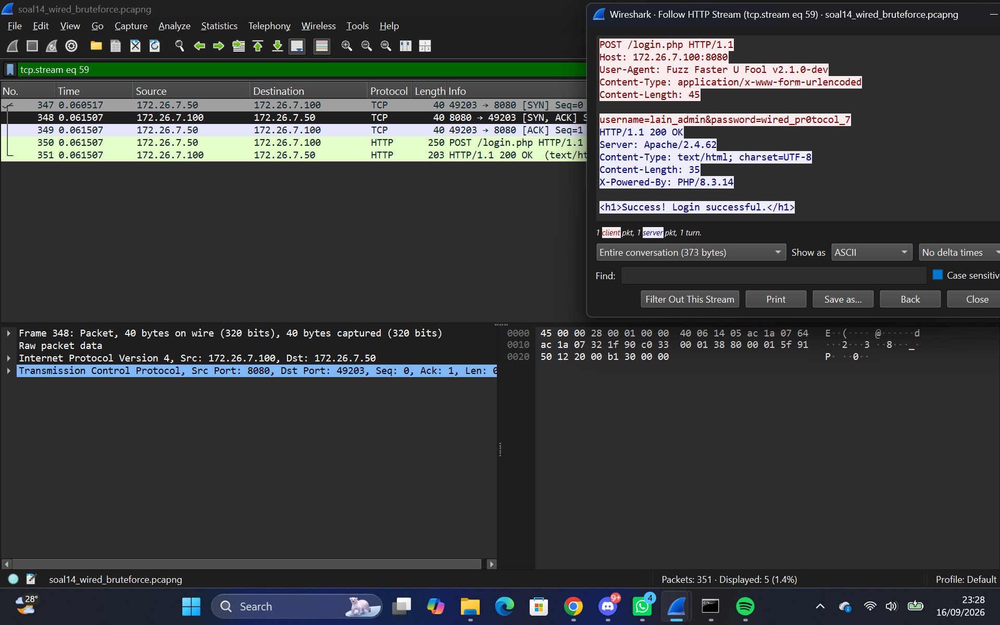

3. Cek `Statistics > Endpoints > IPv4` untuk mengidentifikasi IP penyerang

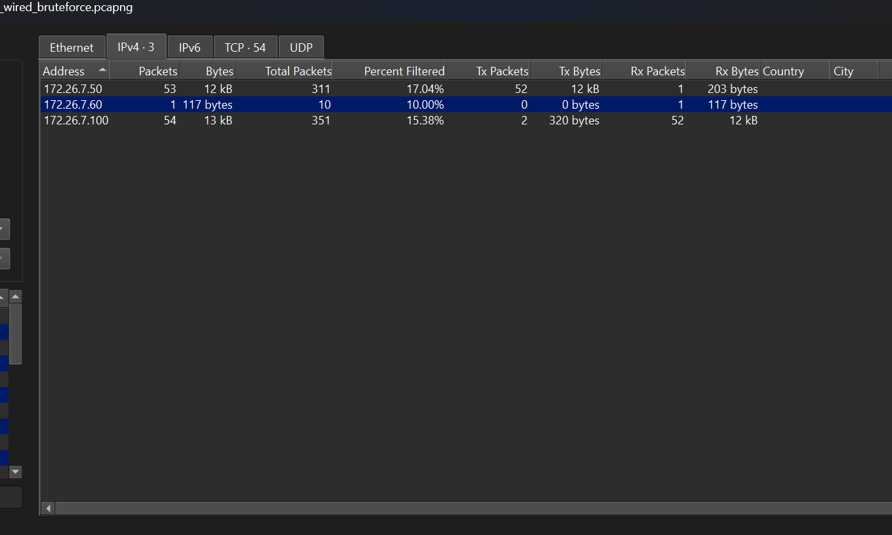

4. Klik kanan paket `POST /login.php > Follow > HTTP Stream` untuk menemukan kredensial yang berhasil login


### 2. Command
1. Buka cmd, lalu pindah ke wsl dengan mengetik `wsl`.
2. ketik `nc [IP_Group] 3401` dalam case ini, kami menggunakanan punya kami.
```bash
nc 10.4.89.247 3401
```
3. Isi pertanyaan berdasarkan data yang telah diperoleh, lalu nanti akan mendapatkan hasilnya. Dalam case kami, kami mendapatkan hasil seperti ini:
- Attacker IP: 172.26.7.50

- Target IP & Port: 172.26.7.100:8080

- Password (lain_admin): wired_pr0tocol_7

- Server Version: Apache/2.4.62

- Flag: KOMJAR26{W1r3d_Brut3_Ye82BmLajC1L7cIJfGwwEbkHh}

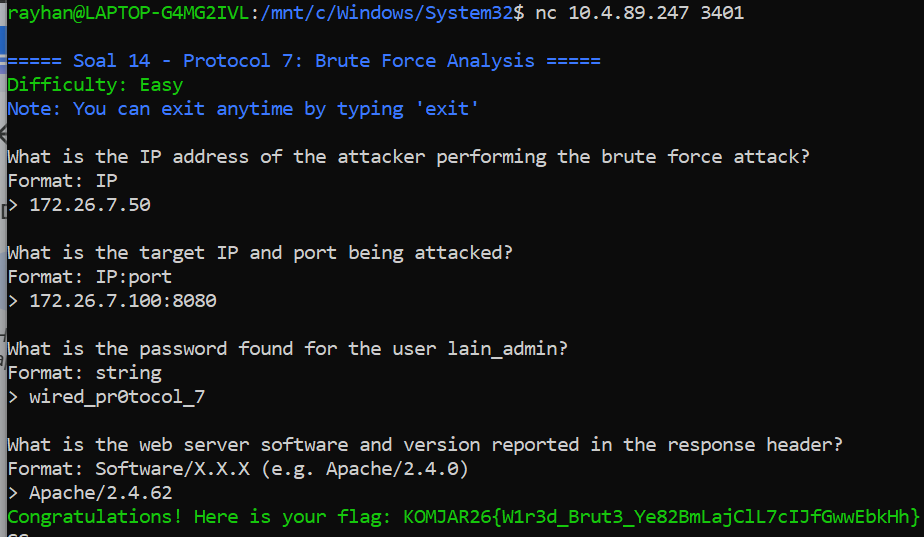

## Soal 15
Eiri menyusup ke ruang server dan memasang perangkat keyboard USB berbahaya pada node Alice. Buka file capture wired_usb_hid.pcap, identifikasi Vendor ID dan Product ID perangkat USB dari deskriptor USB, alamat nomor device USB, serta pesan rahasia yang berhasil dicuri dari keystroke. Validasi temuan kalian pada socket server: ([Link File](https://drive.google.com/drive/folders/1oAPzN9IEN0264_LlvGnl_CsIiYh-Hp8w?usp=drive_link)) `nc [IP_Group] 3402`

### 1. Langkah Pengerjaan
1. Buka File `soal15_wired_usb_hid.pcap` melalui `Link File`.
2. Melakukan Filter.
```bash
usb.idVendor || usb.bDescriptorType == 1
```
3. Cek Frame 2 (`GET DESCRIPTOR Response DEVICE`) pada panel `DEVICE DESCRIPTOR` untuk menemukan `Vendor ID (0x046d)`, `Product ID (0xc31c)`, dan `USB Device Address (2/7)`.

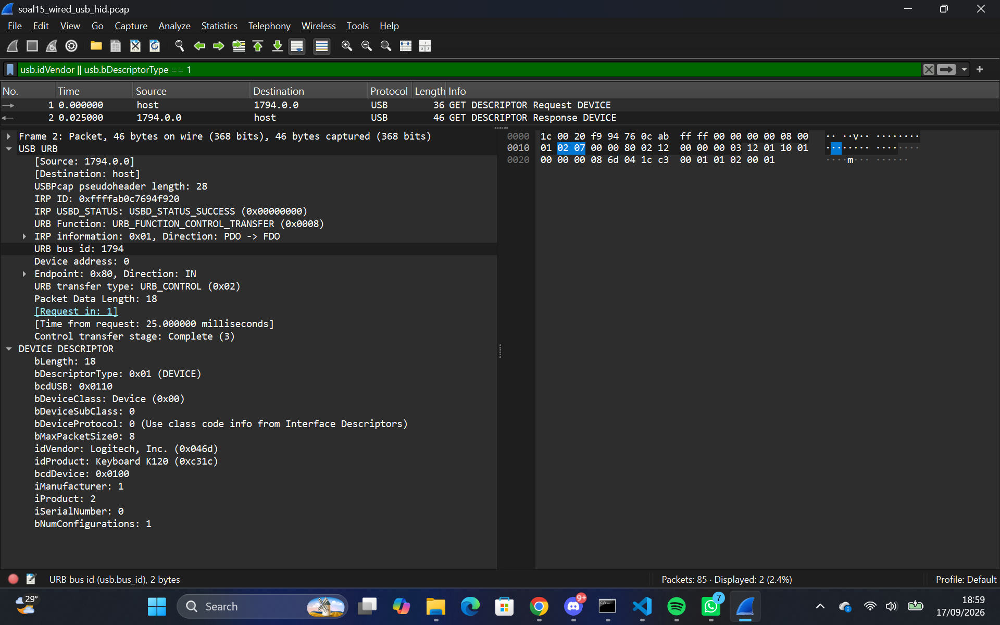

4. Ekstrak data raw keystroke menggunakan `tshark` dari terminal WSL:
```bash
tshark -r /mnt/c/Users/rayhan/Downloads/soal15_wired_usb_hid.pcap -Y "usb.capdata" -T fields -e usb.capdata
```
Hasil sebelum decode:
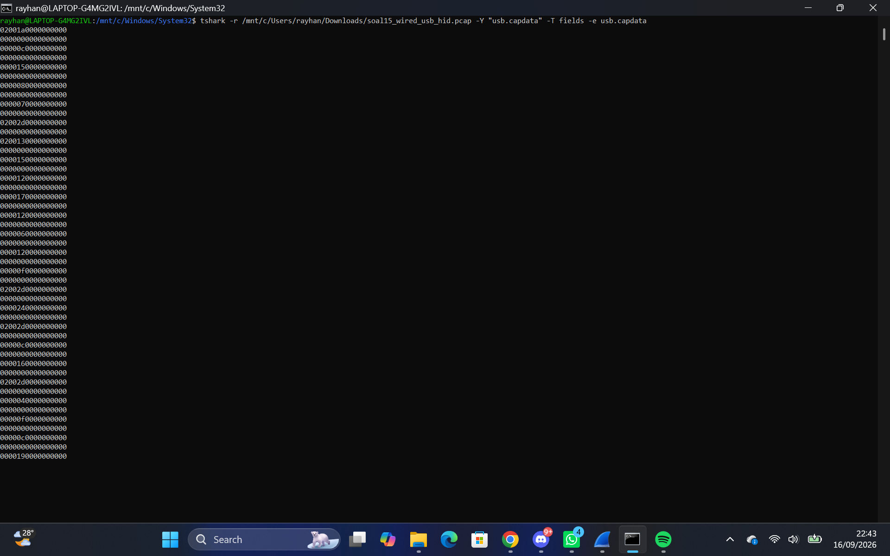

Hasil setelah decode:
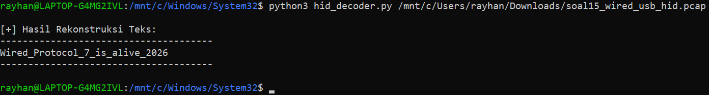

### 2. Command
1. Buka cmd, lalu pindah ke wsl dengan mengetik `wsl`.
2. ketik `nc [IP_Group] 3401` dalam case ini, kami menggunakanan punya kami.
```bash
nc 10.4.89.247 3402
```
3. Isi pertanyaan berdasarkan data yang telah diperoleh, lalu nanti akan mendapatkan hasilnya. Dalam case kami, kami mendapatkan hasil seperti ini:
- Vendor ID: 0x046d

- Product ID: 0xc31c

- USB Device Address: 7

- Secret Message: Wired_Protocol_7_is_alive_2026

- Flag: KOMJAR26{USB_K3ystr0k3_Ks09UgdPL9kvS3UKjVHDkJScg}

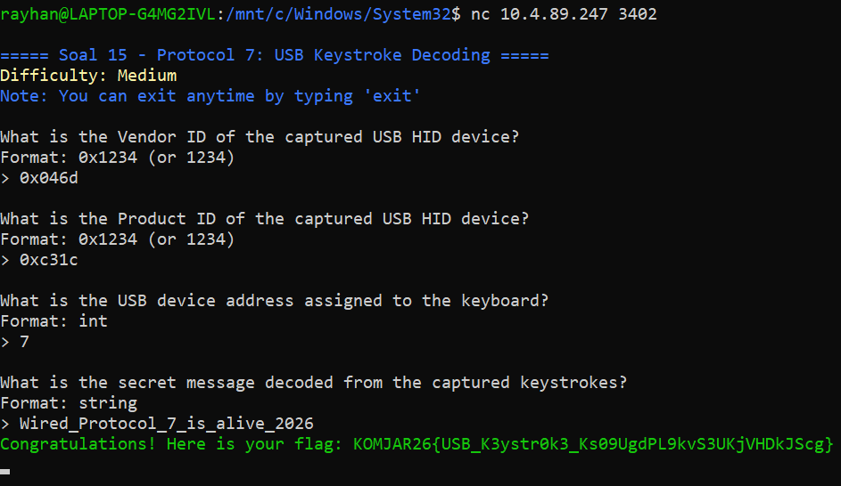

## Soal 16
Eiri meletakkan file malware di server. Dari file capture wired_ftp_theft.pcap, lakukan analisis lalu lintas FTP untuk mengidentifikasi alamat IP server FTP penyerang, banner software FTP yang digunakan, kredensial login penyerang, serta ukuran (size in bytes) dari file malware knights_payload.exe yang diunduh. Validasi temuan kalian pada socket server:
([Link File](https://drive.google.com/drive/folders/1qBeAXVx1MG14L0jzGefqs3t8qO8VRMmb?usp=sharing)) `nc [IP_Group] 3403` 

### 1. Langkah Pengerjaan
1. Buka File `soal16_wired_ftp_theft.pcap` melalui `Link File`.
2. Melakukan Filter.
```bash
ftp
```
3. Pada bagian info akan menampilkan jawaban-jawabannya

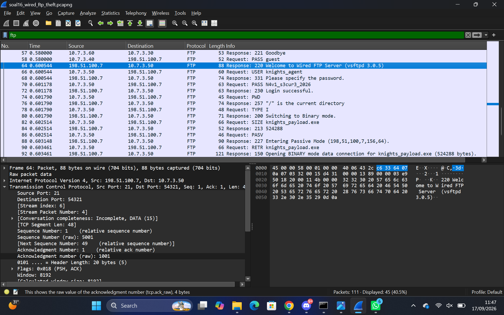

### 2. Command
1. Buka cmd, lalu pindah ke wsl dengan mengetik `wsl`.
2. ketik `nc [IP_Group] 3401` dalam case ini, kami menggunakanan punya kami.
```bash
nc 10.4.89.247 3403
```
3. Isi pertanyaan berdasarkan data yang telah diperoleh, lalu nanti akan mendapatkan hasilnya. Dalam case kami, kami mendapatkan hasil seperti ini:
- FTP Username: knights_agent

- FTP Password: N4v1_s3cur3_2026

- Downloaded File Name: knights_payload.exe

- FTP Server Version: vsftpd 3.0.5

- Flag: KOMJAR26{FTP_Th3ft_sfFYZTP1Y7PFqpMBFDyQswKFQ}


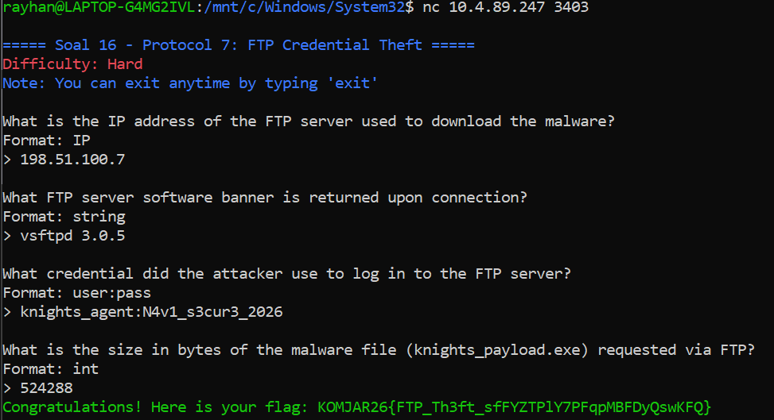

## Soal 17
Alice membuat halaman web di node-nya. Eiri memanfaatkan celah untuk mengunduh payload berbahaya ke sistem Alice. Analisis file capture wired_http_c2.pcap untuk mengidentifikasi nama domain (Host) tempat malware diunduh, alamat IP server penyerang, nama file executable malware yang diunduh, serta kode status HTTP yang dikembalikan. Validasi temuan kalian pada socket server:
([Link File](https://drive.google.com/drive/folders/1iPYESj5AN-uXYXfD2Wo2cRrm_Rigr_D6?usp=sharing)) `nc [IP_Group] 3404`

### 1. Langkah Pengerjaan
1. Buka File `soal17_wired_http_c2.pcap` melalui `Link File`.
2. Melakukan Filter.
```bash
http.request.method == "GET"
```
3. Temukan request unduhan berkas executable malware `/navi_agent.exe.`
4. Buka detail header Hypertext Transfer Protocol untuk menemukan domain (`Host: wired-update.net`) dan status HTTP.
5. Periksa IPv4 Destination Address untuk mencatat IP server penyerang.

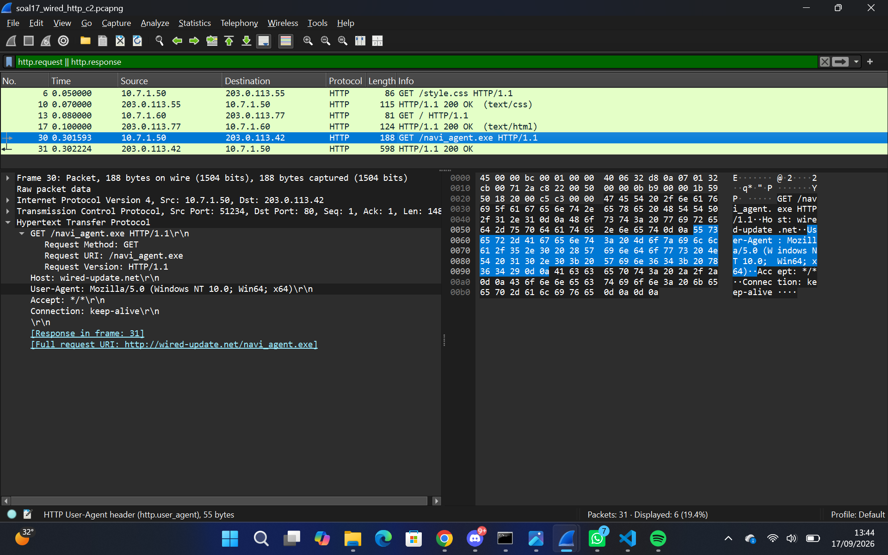

### 2. Command
1. Buka cmd, lalu pindah ke wsl dengan mengetik `wsl`.
2. ketik `nc [IP_Group] 3401` dalam case ini, kami menggunakanan punya kami.
```bash
nc 10.4.89.247 3404
```
3. Isi pertanyaan berdasarkan data yang telah diperoleh, lalu nanti akan mendapatkan hasilnya. Dalam case kami, kami mendapatkan hasil seperti ini:
- Domain Name (Host): wired-update.net

- Attacker Server IP: 198.51.100.7

- Malware Executable Filename: navi_agent.exe

- HTTP Status Code: 200

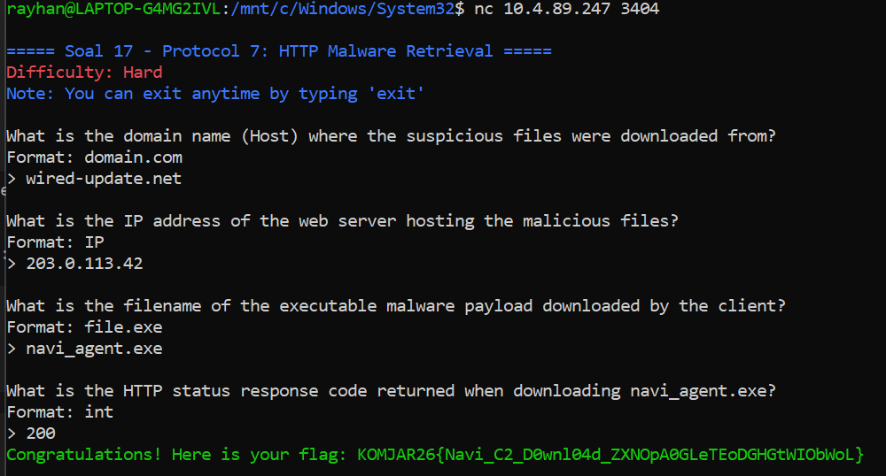

## Soal 18
Eiri mengubah taktik penyerangan dengan menanamkan file malware menggunakan protokol file sharing SMB. Analisis file capture wired_smb_transfer.pcapng untuk mengidentifikasi nama protokol jaringan yang dieksploitasi, IP pengirim dan penerima, folder tujuan penyimpanan malware pada sistem korban, serta nama file executable malware yang ditransfer. Validasi temuan kalian pada socket server: ([Link File](https://drive.google.com/file/d/1XBtKWtNM_RrSBTp2e3O5vBdiklcPNsKs/view?usp=sharing)) `nc [IP_Group] 3405`
### 1. Langkah Pengerjaan
1. Buka File `soal18_wired_smb_transfer.pcapng` melalui `Link File`.
2. Melakukan Filter.
```bash
smb2
```
3. Buka paket `Tree Connect Request` untuk mencatat target IP (`10.7.1.50`) dan nama Share (`ADMIN$`).

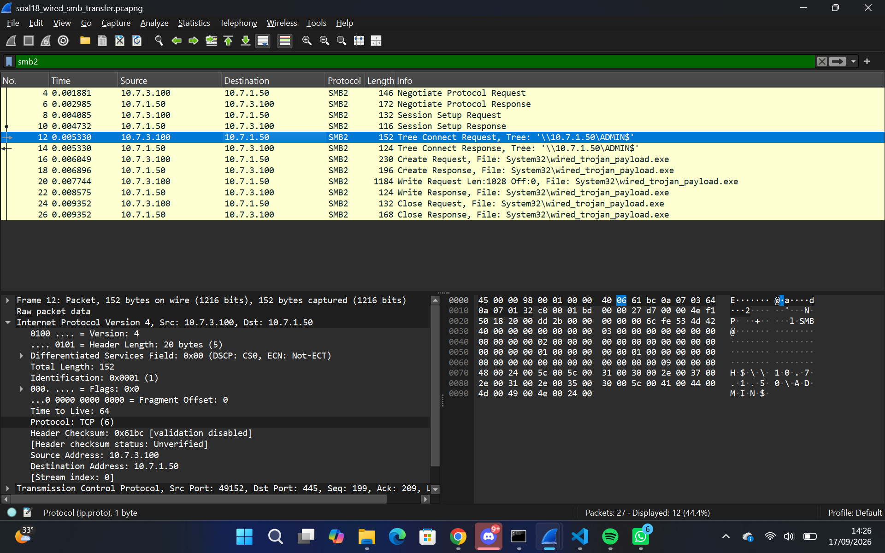

### 2. Command
1. Buka cmd, lalu pindah ke wsl dengan mengetik `wsl`.
2. ketik `nc [IP_Group] 3401` dalam case ini, kami menggunakanan punya kami.
```bash
nc 10.4.89.247 3405
```
3. Isi pertanyaan berdasarkan data yang telah diperoleh, lalu nanti akan mendapatkan hasilnya. Dalam case kami, kami mendapatkan hasil seperti ini:
- Protocol Name: SMB2

- Sender IP: 172.26.7.50

- Receiver IP: 10.7.1.50

- Destination Share/Folder: ADMIN$

- Malware Executable Filename: wired_trojan_payload.exe

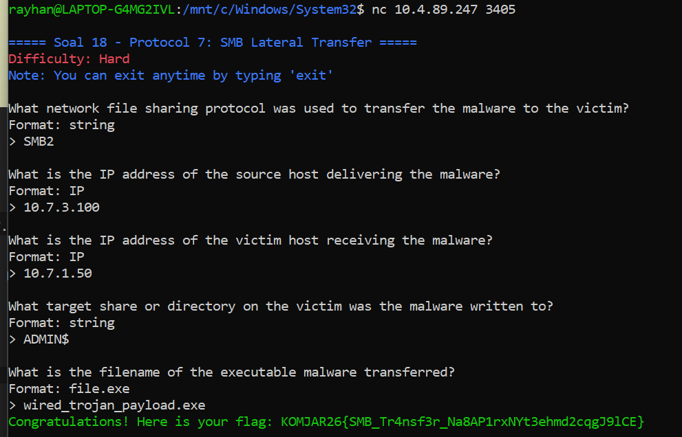

## Soal 19
Eiri meneror jaringan dengan mengirimkan email pemerasan melalui protokol SMTP tanpa enkripsi. Analisis file capture wired_smtp_threat.pcap pada stream TCP terkait, identifikasi alamat email korban yang ditargetkan, password korban yang diklaim bocor oleh penyerang, jenis malware yang diinfeksikan, batas waktu (dalam hari) yang diberikan, serta MailClientID yang tercantum pada pesan. Validasi temuan kalian pada socket server: ([Link File](https://drive.google.com/drive/folders/1RAW0cMoGDDStPyFHeJ_0t9kkoLGBsCmH?usp=sharing)) `nc [IP_Group] 3406`
### 1. Langkah Pengerjaan
1. Buka File `soal19_wired_smtp_threat.pcap` melalui `Link File`.
2. Melakukan Filter.
```bash
smtp
```
3. Klik kanan paket `SMTP > Follow > TCP Stream`.
4. Baca isi pesan email pemerasan untuk mengekstrak email korban (`victim@protocol7.co.jp`), password yang bocor, jenis malware, batas waktu, dan MailClientID.

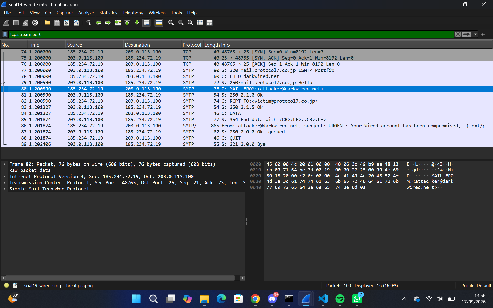

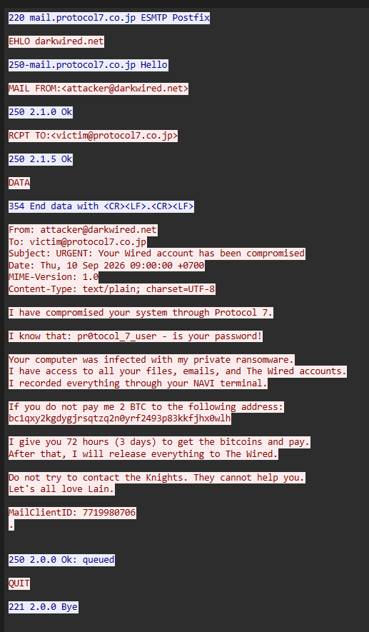

### 2. Command
1. Buka cmd, lalu pindah ke wsl dengan mengetik `wsl`.
2. ketik `nc [IP_Group] 3401` dalam case ini, kami menggunakanan punya kami.
```bash
nc 10.4.89.247 3406
```
3. Isi pertanyaan berdasarkan data yang telah diperoleh, lalu nanti akan mendapatkan hasilnya. Dalam case kami, kami mendapatkan hasil seperti ini:
- Victim Email Address: victim@protocol7.co.jp

- Leaked Password: pr0tocol_7_user

- Malware Type: ransomware

- Time Limit (Days): 3

- MailClientID: 7719980706

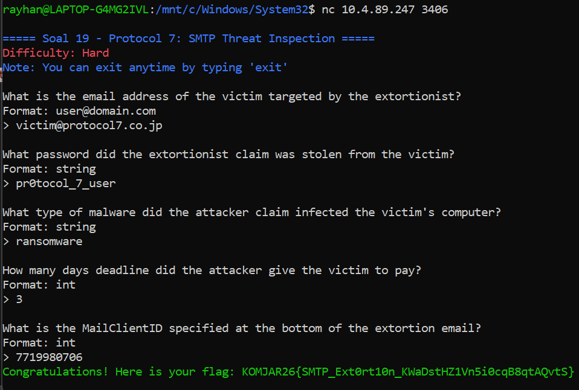

## Soal 20
Untuk rencana pamungkasnya, Eiri menyembunyikan komunikasi malware di balik saluran terenkripsi TLS. Namun Alice telah menyediakan file keylog untuk mendekripsi lalu lintas data tersebut. Analisis file capture wired_tls_decrypt.pcapng bersama keyslogfile.txt untuk mengidentifikasi versi protokol TLS yang dinegosiasikan, nama domain (SNI) yang diakses, alamat IP server HTTPS penyerang, User-Agent yang digunakan, serta HTTP request method dan path yang tersembunyi di dalam sesi dekripsi. Validasi temuan kalian pada socket server: ([Link File](https://drive.google.com/file/d/1F7xN3ydIrA-pZaCb32MGseVeHKt-D_qZ/view?usp=sharing)) `nc [IP_Group] 3407`

### 1. Langkah Pengerjaan
1. Buka File `soal20_wired_tls_decrypt.pcapng`melalui `Link File`.
2. Impor file SSL Keylog: `Edit > Preferences > Protocols > TLS > (Pre)-Master-Secret log filename > arahkan ke keyslogfile.txt`.
3. Amati paket Frame 1 (`Client Hello`) untuk mencatat TLS Version (`TLSv1.2`), SNI (`example.com`), dan Destination IP (`93.184.216.34`).
Setelah dekripsi aktif, periksa paket HTTP No. 6 (HEAD / HTTP/1.1) atau `klik kanan > Follow > HTTP Stream` untuk mendapatkan User-Agent (`curl/7.68.0`), dan HTTP Method (`HEAD`).

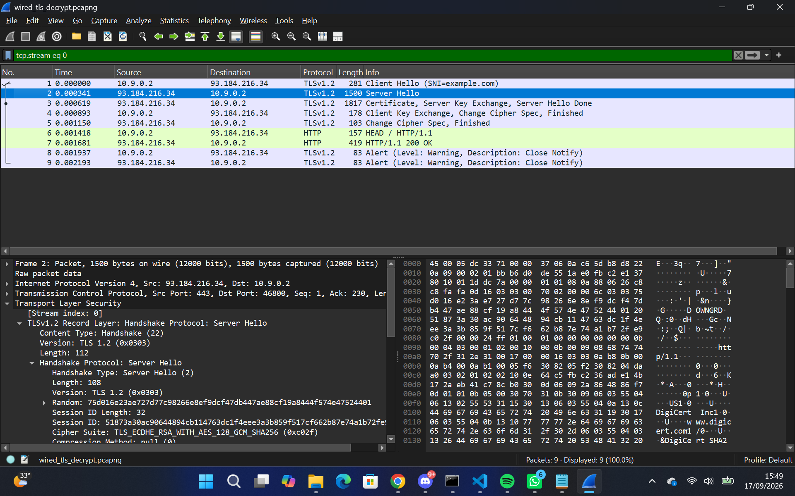

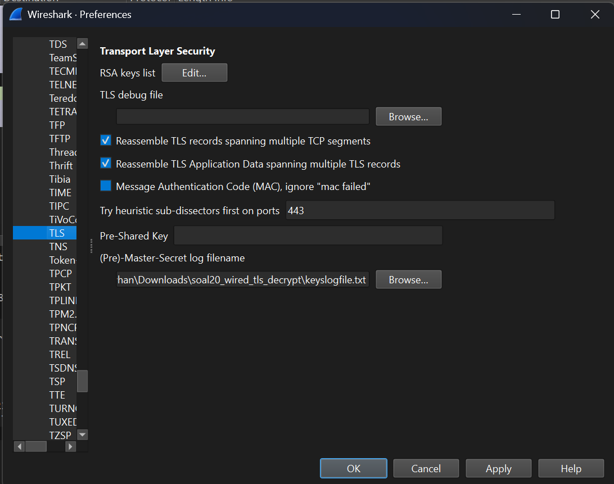

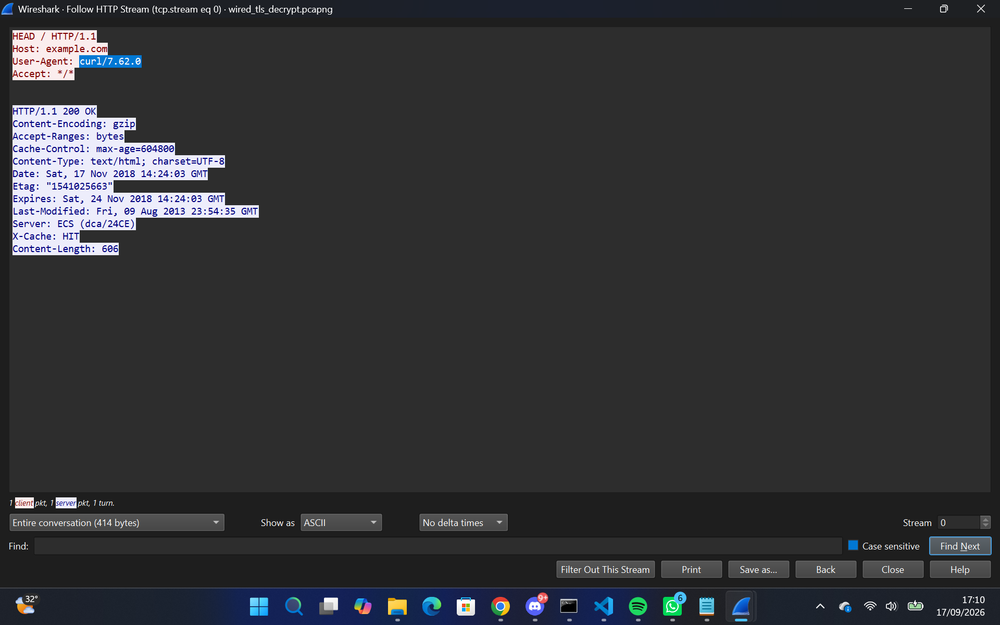

### 2. Command
1. Buka cmd, lalu pindah ke wsl dengan mengetik `wsl`.
2. ketik `nc [IP_Group] 3401` dalam case ini, kami menggunakanan punya kami.
```bash
nc 10.4.89.247 3407
```
3. Isi pertanyaan berdasarkan data yang telah diperoleh, lalu nanti akan mendapatkan hasilnya. Dalam case kami, kami mendapatkan hasil seperti ini:
TLS Version: TLSv1.2

- Domain Name (SNI): example.com

- Attacker HTTPS Server IP: 93.184.216.34

- User-Agent: curl/7.68.0

- HTTP Method: HEAD

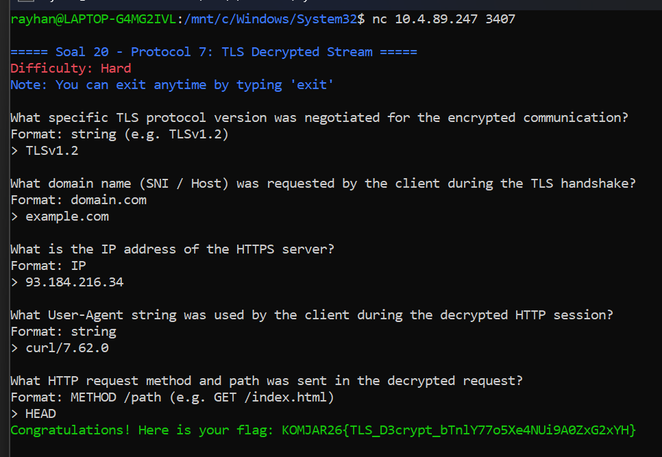
